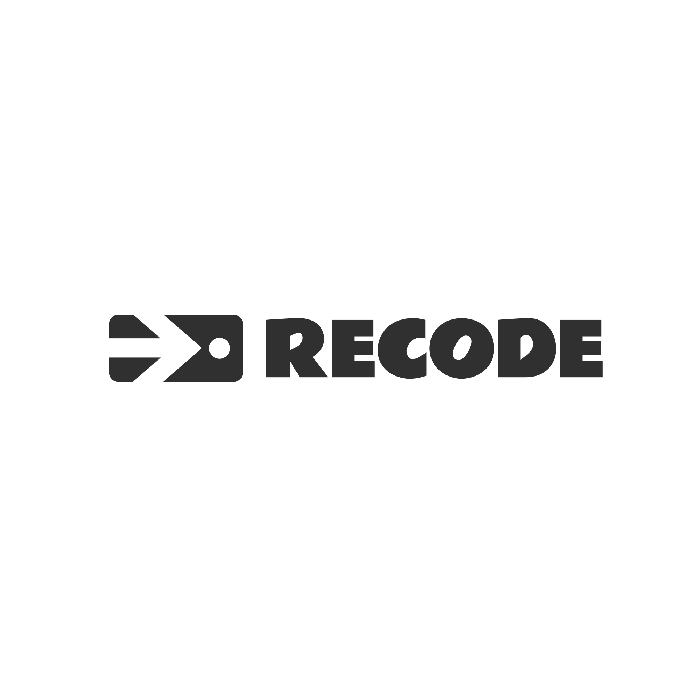

# Recode

<div align="center">
  <!--  -->
  
  **Collaborative Code Review Platform with AI-Powered Analysis**
  

  [Live Demo](#) | [Documentation](#) | [Report Bug](#) | [Request Feature](#)
</div>

---

## Table of Contents

- [Overview](#overview)
- [Features](#features)
- [Architecture](#architecture)
- [Tech Stack](#tech-stack)
- [Getting Started](#getting-started)

---

## Overview

**Recode** is a modern, collaborative code review platform designed to streamline the development workflow. It combines AI-powered code analysis with real-time team collaboration, helping developers write better code through constructive feedback and automated insights.

---

## Features

### Core Functionality
- **Multi-Language Support** - JavaScript, Python, TypeScript, Java, Go, Rust
- **AI-Powered Analysis** - Automatic detection of code smells, security issues, and performance bottlenecks
- **Threaded Comments** - Line-by-line discussions with @mentions and emoji reactions
- **Workflow Management** - Status tracking from draft to approved with multi-reviewer approval
- **Analytics Dashboard** - Personal and team metrics with interactive visualizations
- **Advanced Search** - Full-text search with filters and saved presets
- **Diff Viewer** - Side-by-side and inline comparison of code changes
- **Dark/Light Mode** - Full theme support with system preference detection
- **Real-time Updates** - Live notifications and comment synchronization
- **Accessible** - WCAG 2.1 AA compliant with keyboard navigation

### Advanced Features
- **Responsive Design** - Optimized for mobile, tablet, and desktop
- **Offline Support** - Service worker for offline functionality
- **Keyboard Shortcuts** - Power user features with shortcut overlay
- **Gamification** - Points, badges, and leaderboards for engagement
- **Export Capabilities** - CSV/PDF reports for metrics
- **Shareable Links** - Embeddable code snippets with live syntax highlighting

---

## Getting Started

### Prerequisites
- Node.js 18.x or higher
- npm 9.x or yarn 1.22+
- Modern browser (Chrome, Firefox, Safari, Edge - last 2 versions)

### Installation

```bash
# Clone the repository
git clone https://github.com/farooq13/mergecode.git
cd mergecode

# Install dependencies
npm install

# Start development server
npm run dev
```


### Performance Budget

| Metric | Target | Maximum |
|--------|--------|---------|
| First Contentful Paint | < 1.5s | 2s |
| Time to Interactive | < 2.5s | 3s |
| Total Bundle Size | < 300KB | 500KB |
| Main Thread Idle | > 50% | > 40% |
| Code Highlighting | < 100ms | 200ms |
| AI Analysis | < 500ms | 1s |


